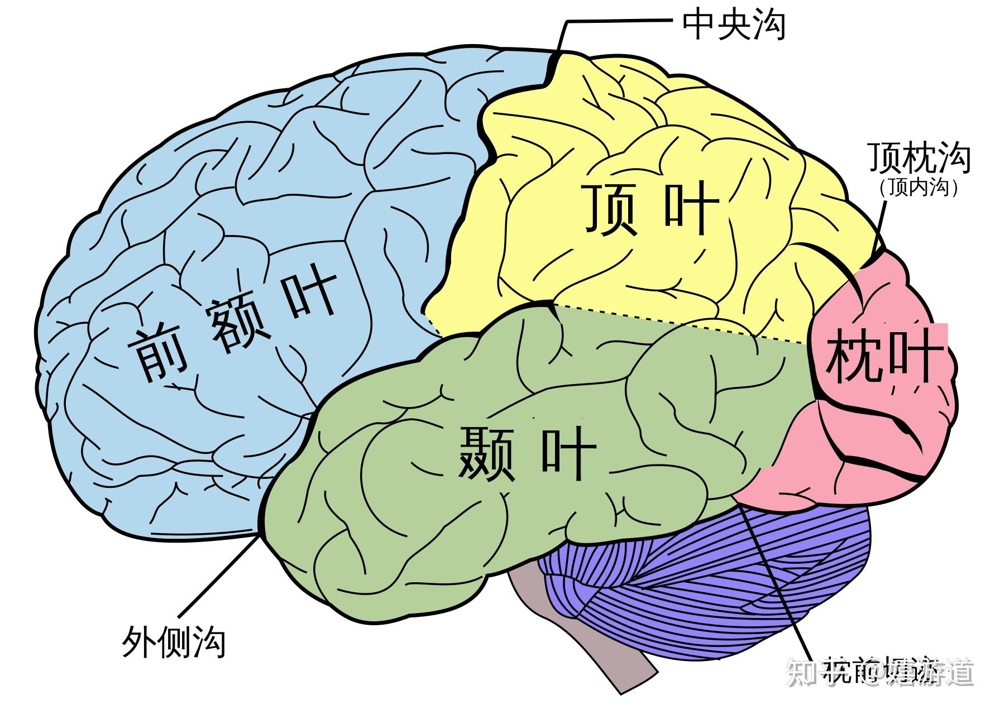

## 🧠 一、大脑脑叶的基本划分

大脑皮层分为左右两个半球，每个半球又分为**四个脑叶**，以颅骨上的沟回为界：

| 脑叶     | 主要位置         | 功能概览              |
| ------ | ------------ | ----------------- |
| **额叶** | 前部，位于眼眶上方    | 执行功能、决策、情绪调节、语言产生 |
| **顶叶** | 顶部中央，紧邻中央沟后方 | 感觉整合、空间定位、身体感知    |
| **颞叶** | 两侧，耳朵上方      | 听觉处理、记忆、语言理解、情绪   |
| **枕叶** | 后部，枕骨下方      | 视觉信息处理中心          |

| 脑叶     | 核心功能                      | 典型损伤表现                  |
| ------ | ------------------------- | ----------------------- |
| **额叶** | 运动控制、执行功能、情绪调节、语言产生（布洛卡区） | 人格改变、冲动、失语症（表达性失语）、运动障碍 |
| **顶叶** | 触觉、空间感知、身体地图、数学计算         | 感觉缺失、空间忽视（忽略一侧身体）、失读症   |
| **颞叶** | 听觉、记忆、语言理解（韦尼克区）、情绪       | 听觉障碍、失忆、癫痫、精神症状（如幻觉）    |
| **枕叶** | 视觉处理、图像识别                 | 失明、视觉幻觉、无法识别物体（视觉失认）    |

---

## 🔍 二、各脑叶的重要结构

### 1. **额叶**

- **初级运动皮层**（Primary Motor Cortex）：位于中央前回，控制对侧身体运动
- **前额叶皮层**（Prefrontal Cortex）：负责高级认知功能（如计划、判断、自我控制）

---
### 2. **顶叶**

- **顶上小叶**（Superior Parietal Lobule）：空间导航、注意力分配
- **顶下小叶**（Inferior Parietal Lobule）：数字处理、语言整合（如角回）

---
### 3. **颞叶**

- **海马体**（Hippocampus）：长期记忆形成的关键结构
- **杏仁核**（Amygdala）：情绪（尤其是恐惧）处理中心

---
### 4. **枕叶**

- **初级视觉皮层**（Primary Visual Cortex）：处理基本视觉信息（如颜色、形状、运动）
- **视觉联合皮层**：更高阶的视觉识别（如人脸识别、物体识别）

---

## 🧪 三、经典案例说明

### 🧠 案例1：**布洛卡失语症**（Broca’s Aphasia）
- **损伤部位**：左额叶的**布洛卡区**（Broca’s Area）
- **表现**：能理解语言，但说话困难、语法混乱
- **说明**：额叶负责语言**产出**

### 🧠 案例2：**韦尼克失语症**（Wernicke’s Aphasia）
- **损伤部位**：左颞叶的**韦尼克区**
- **表现**：说话流利但无意义，无法理解他人语言
- **说明**：颞叶负责语言**理解**

### 🧠 案例3：**视觉失认症**
- **损伤部位**：枕叶或枕颞连接区
- **表现**：看见物体却无法识别（如认不出苹果）
- **说明**：枕叶处理视觉信息，但需与颞叶协同完成识别